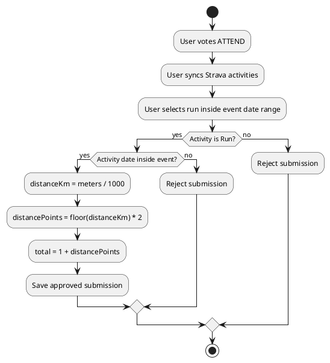

# SPEC-1-Running Responsive Mini Web

## Background

The system is a mobile-first mini web application for running events. Admins create running events, users register, vote whether they will attend, connect Strava, submit only valid Strava running activities for the selected event, receive points, and share their results to social media.

## Requirements

### Must Have

- Mobile responsive web UI.
- User registration and login.
- Admin event creation with date range and status.
- User attendance voting: attend or not attend.
- Strava OAuth integration.
- Sync Strava running activities for the event date range.
- Restrict submissions to activities matching an admin-created event.
- Score rule: attendance = 1 point; each completed 1km = 2 points.
- Event leaderboard.
- Share result page with mobile share support and copy link fallback.

### Should Have

- Admin role seed script.
- Public share page with Open Graph metadata.
- Duplicate submission prevention.
- Database-backed session management.

### Could Have

- Strava webhook auto-sync.
- Admin approval workflow for suspicious submissions.
- Team-based scoring.
- Export leaderboard to CSV.

### Won't Have in MVP

- Native mobile app.
- Direct posting into Instagram/XHS through private or unofficial APIs.
- Payment or merchandise flow.

## Method

### Architecture

```plantuml
@startuml
actor User
actor Admin
rectangle "Next.js Mini Web" {
  component "Auth Pages"
  component "Event Pages"
  component "Admin Pages"
  component "Strava OAuth Routes"
  component "Share Result Page"
}
database "PostgreSQL" {
  entity "User"
  entity "Event"
  entity "EventVote"
  entity "StravaToken"
  entity "StravaActivity"
  entity "Submission"
}
cloud "Strava API"

User --> "Auth Pages"
User --> "Event Pages"
User --> "Share Result Page"
Admin --> "Admin Pages"
"Strava OAuth Routes" --> "Strava API"
"Event Pages" --> "PostgreSQL"
"Admin Pages" --> "PostgreSQL"
"Strava OAuth Routes" --> "PostgreSQL"
@enduml
```

### Scoring Algorithm



### Database

The MVP uses Prisma with PostgreSQL. The source includes:

- `prisma/schema.prisma`
- `database/schema.sql`

Core tables:

- `User`
- `Session`
- `Event`
- `EventVote`
- `StravaToken`
- `StravaActivity`
- `Submission`

## Implementation

1. Configure PostgreSQL and environment variables.
2. Run Prisma migration.
3. Seed admin user.
4. Configure Strava developer app callback URL.
5. Create event from admin dashboard.
6. Users register and vote.
7. Users connect Strava and sync event runs.
8. Users submit a synced run.
9. Leaderboard and share pages update automatically.

## Milestones

1. Project setup and database migration.
2. Authentication and admin role.
3. Event management.
4. RSVP voting.
5. Strava OAuth and activity sync.
6. Submission and scoring.
7. Leaderboard and sharing.
8. Production hardening.

## Gathering Results

- Validate that users cannot submit without login, attend vote, Strava connection, and event-matching run.
- Validate score formula with test distances.
- Track Strava sync failures and OAuth callback errors.
- Monitor registration/login error rate.
- Review leaderboard accuracy after every event.

## Need Professional Help in Developing Your Architecture?

Please contact me at [sammuti.com](https://sammuti.com) :)
